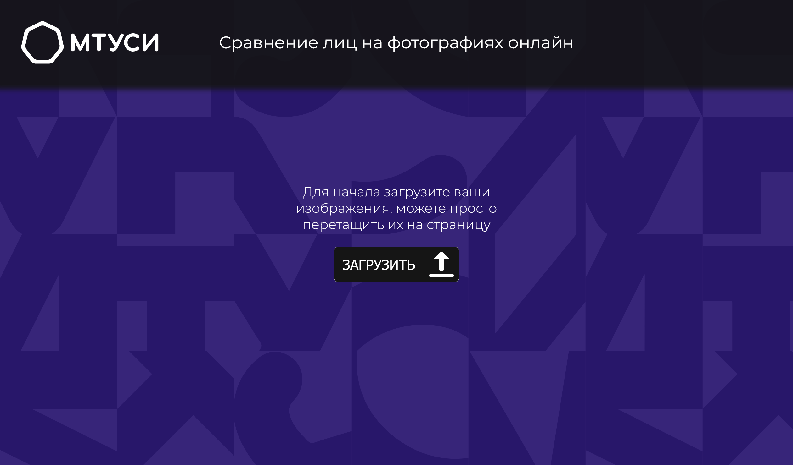
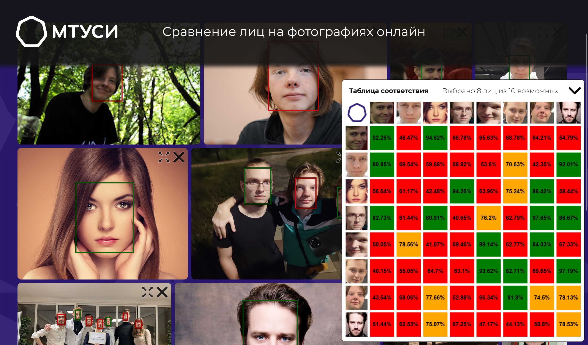

# FaceAI

Фронтенд для сервиса по сравнению лиц на фотографиях с использованием искусственного интеллекта. Написан на реакте с ручной настройкой вебпака по БЭМ

## Запуск

Нужно склонировать репозиторий, поставить зависимости, в .env файл занести нужные настройки (см. раздел "настройка") и запустить веб сервер

### Установка

`git clone https://github.com/DEsimas/FaceAI`

`cd FaceAI`

`pnpm i`

### Для продакшена

`pnpm serve:prod`

### Для разработки

`pnpm hooks`

`pnpm serve:dev`

## Настройка

В .env файле нужно указать следующие переменные:

```
# Порт, на котором будет работать веб-сервер
# Если не указан, то будет 9000
PORT=9000

# Сюда приложение будет отправлять запросы
# Подразумевается, что это тот адрес, на котором хостится приложение
# И там стоит прокси сервер, который перенаправляет запросы на InsightFace-REST API
URL=https://facecompare.com

# Адрес InsightFace-REST API, на него прокси будет переводить запросы
API=http://backend:9000

# true - использовать захардкоженные данные как ответы на запросы
# false - делать запросы к серверу
USE_MOCK=false

# id для подключения яндекс метрики
YANDEX_METRIKA_ID=12345678
```

## Preview






